# Инструкция по добавлению бризера TION Bio X в Home Assistant

Данная инструкция описывает возможность добавления бризера TION Bio X в умный дом Home Assistant без использования микроконтроллера ESP32 и разборки бризера. Все операции выполняются программно, используя модуль Tuya в бризере. В результате управление бризером возможно как через Home Assistant (локально), так и через приложение Smart Life.

На данный момент есть два варианта подключения бризера в Home Assistant:
1. Мгновенные сценарии в интеграции Tuya. **Самый простой вариант**
2. Интеграция через LocalTuya integration. **Более сложный, но гибкий вариант**

## Добавление бризера в Smart Life
Для реализации обоих способов необходимо добавить бризер в Smart Life. При этом, если бризер был добавлен в TION Smart, то он пропадет оттуда. Устройство не может быть одновременно в этих приложениях.
При добавлении, необходимо выбрать в меню «Мелкая бытовая техника» - «Отопление, вентиляция и кондиционирование (Wi-Fi)».

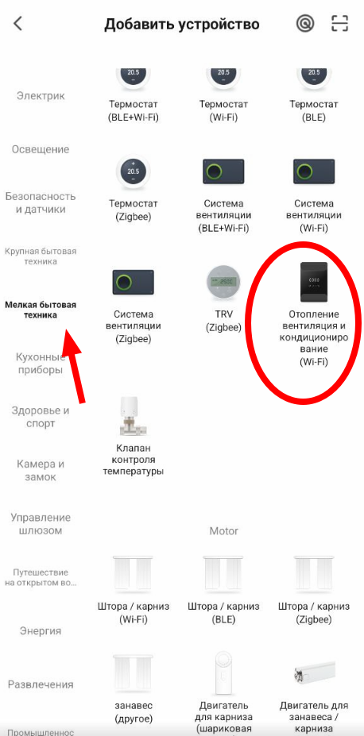

Переводим бризер в режим сопряжения и указываем в приложении что индикатор мигает быстро.

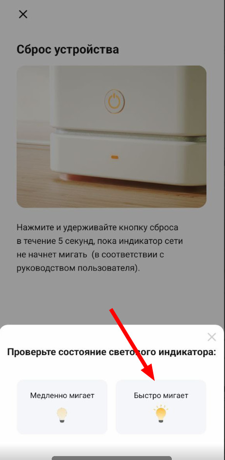

Смартфон должен быть подключен к сети Wi-Fi с диапазоном 2,4 ГГц. Подключение к сети 5 ГГц можно оставить только в том случае, если бризер уже добавлен в TION Smart.


## Мгновенные сценарии в интеграции Tuya
Хотя интеграция Tuya в Home Assistant все еще не поддерживает бризер TION Bio X, есть возможность настройки мгновенных сценариев для бризера в приложении Smart Life и их использование в Home Assistant.
Минус такого решения: нет возможности управлять бризером как устройством. Мы можем только дергать быстрые сценарии, заданные в Smart Life. Например, так можно управлять скоростью вентилятора при изменении значений внешнего датчика CO₂. 

### Добавление бризера через мгновенные сценарии
- Создаем мгновенные сценарии для управления бризером в приложении Smart Life. Например, у меня это выключение бризера и скорости от 1 до 7.
- В Home Assistant добавить интеграцию Tuya
- В интеграции привязать аккаунт из приложения Smart Life
- Проверить что объекты быстрых сценарием подгрузились
- Настроить сценарии с полученными объектами

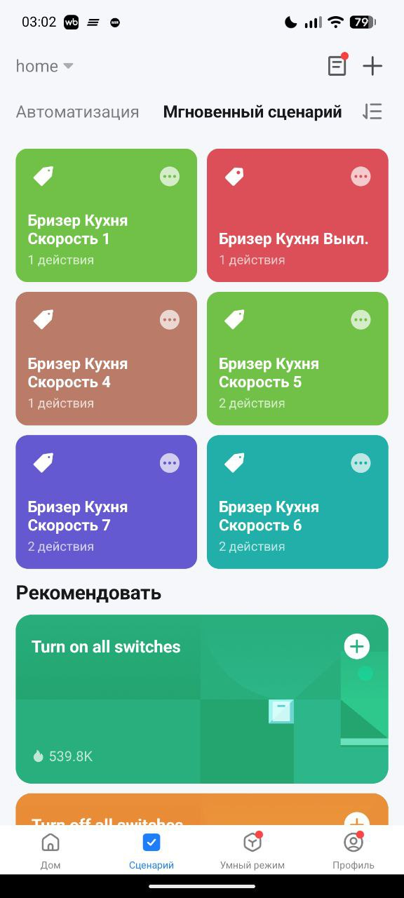

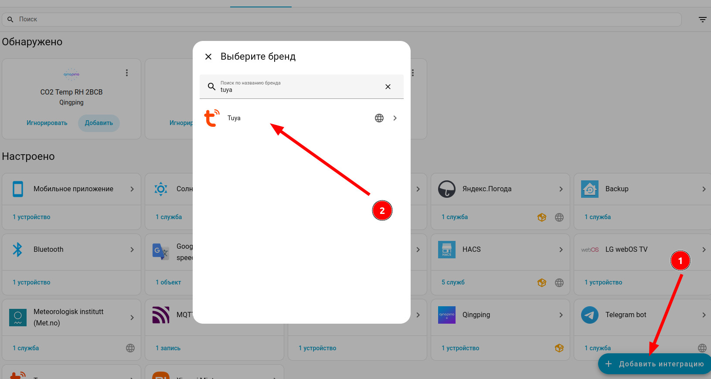


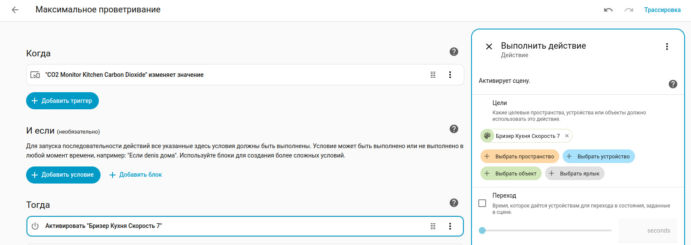


## Интеграция LocalTuya
Бризер можно добавить в Home Assistant как устройство через LocalTuya с ручным добавление сущностей из таблицы инструкций устройства платформы разработчиков Tuya.
Это позволит практически в полной мере использовать доступные объекты бризера для автоматизации. Например, можно получить температуру на входе бризера и управлять цветом панели на основании ресурса фильтров.

### Получаем токены доступа для LocalTuya
- Регистрируемся на сайте платформы разработчиков Tuya [https://platform.tuya.com](https://platform.tuya.com);
- Переключаем язык на английский в настройках или пользуемся переводчиком, сайт на китайском;
- В левом меню выбираем пункт «Cloud», затем «Project Management»; 

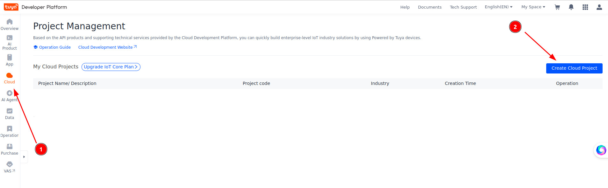

- Жмем на создание проекта (кнопка «Create Cloud Project» в правом углу). Вводим имя проект (например, My Smarthome), выбриаем "Smart Home" в пунктах "Industry" и Development Method". В поле "Data Center" указать тот датацентр, к которому подключается приложение Smart Life. Выбрать в доступных АПИ "IoT Core", "Authorization Token Management" и "Device Status Notification".

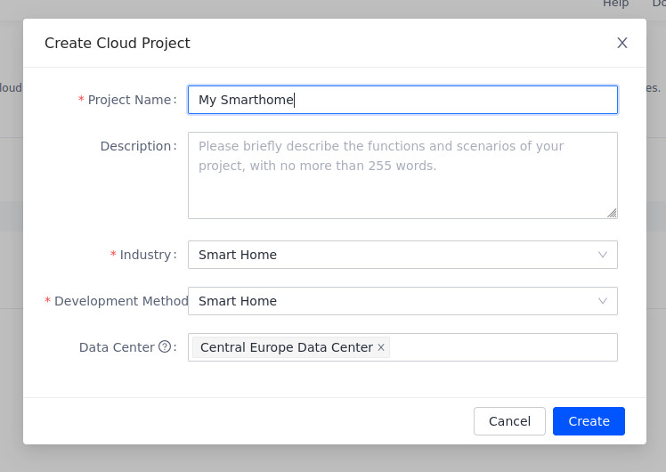

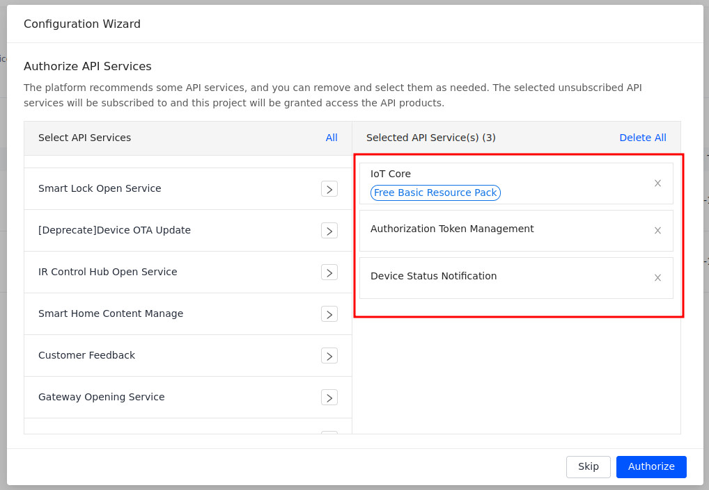

- После создания и авторизации, вас перебросит на вкладку проекта "Overview". Копируем Access ID/Client ID и Access Secret/Client Secret.

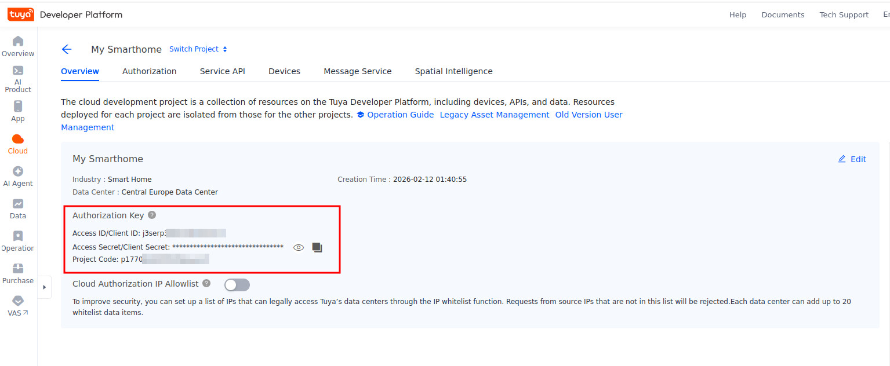

- На верхней вкладке проекта выбираем "Devices" и потом "Link Tuya App Account" и привязываем аккаунт приложения Smart Life (там есть подсказки как это сделать).


### Настройка интеграции LocalTuya
- Установить [HACS](https://hacs.xyz/), если он не установлен;
- Добавить в Home Assistant интеграцию [LocalTuya integration](https://github.com/rospogrigio/localtuya/) (не путать с Tuya Local!);
- По инструкции из [README](https://github.com/rospogrigio/localtuya/blob/master/README.md) localtuya добавляем интеграцию и связываем HA с аккаунтом на платформе разработчика;
- Добавляем новое устройство. Выбираем наш бризер и добавляем необходимые сущности для создания объектов устройства. Ниже привожу таблицу со списком идентификаторов и настроек сущностей. Полный список инструкций можно посмотреть на платформе разработчиков Tuya, если открыть привязанное устройство.

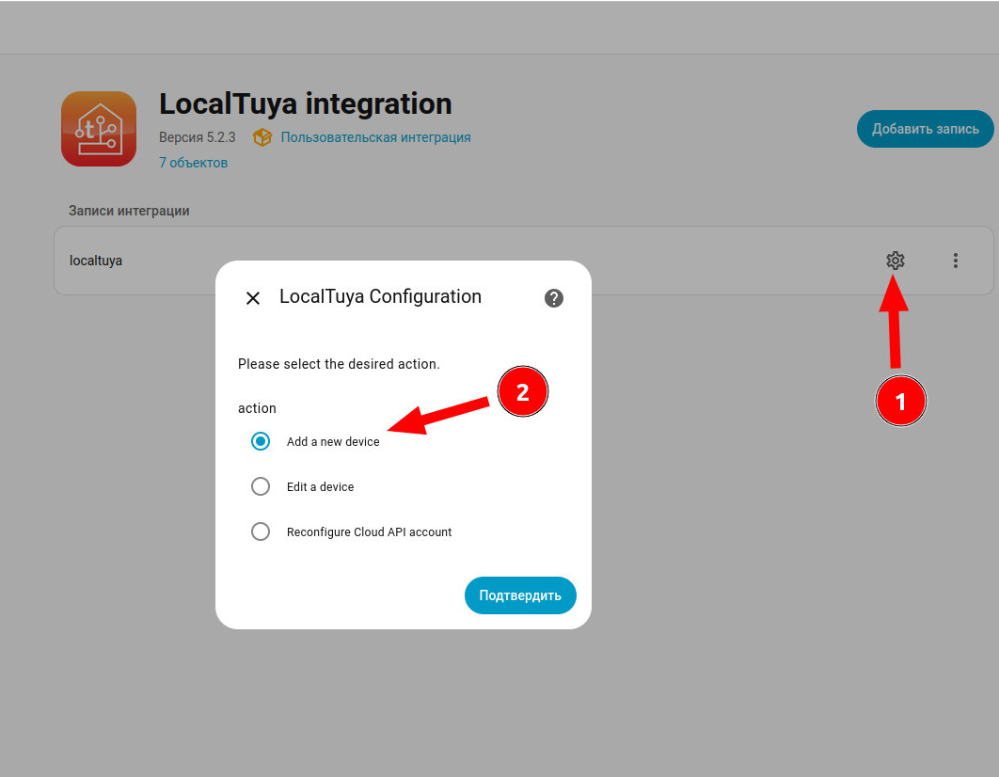

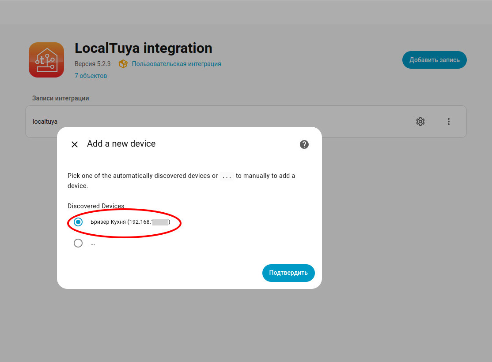

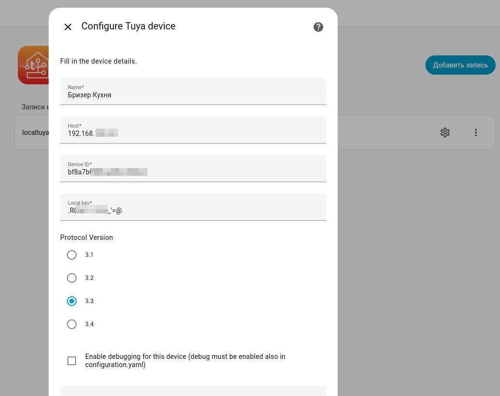

**Таблица настройки сущностей для соответствующих инструкций бризера**

```markdown
| ID  | Friendly Name           | Platform   | Device Class | Minimum Value | Maximum Value | Valid Entries                      | User Friendly Options                     |
|-----|-------------------------|------------|--------------|---------------|---------------|------------------------------------|-------------------------------------------|
| 101 | Питание           		| switch     | -            | -             | -             | -                                  | -                                         |
| 102 | Скорость вентилятора    | number     | -            | 0             | 7             | -                                  | -                                         |
| 103 | Звук                	| switch     | -            | -             | -             | -                                  | -                                         |
| 104 | Световая индикация      | select     | -            | -             | -             | 0;50;100                           | 0%;50%;100%                               |
| 112 | Температура на входе    | sensor     | temperature  | -             | -             | -                                  | -                                         |
| 114 | Подогрев воздуха   	    | number     | -            | 0             | 30            | -                                  | -                                         |
| 115 | Ресурс фильтра          | sensor     | enum         | -             | -             | -                                  | -                                         |
| 133 | Цвет панели             | select     | -            | -             | -             | color0;color1;color2;color3;color4 | Бирюзовый;Фиолетовый;Зелёный;Белый;Желтый | 
```

*Версия LocalTuya integration: 5.2.3

**Полный список доступных инструкций для бризера**
```
power_mode
air_volume
sound
light_mode
heater_mode
co2_value
dp_mode_air
temp_indoor
factory_reset
filter_reset
child_lock
temp_outdoor
dp_worktime
temp_set
filter_life
pm25
heater_state
heater_present
humidity
heater_value
sensor_state_co2
sensor_state_pm25
sensor_state_hum_temp
voice_speed
temp_room
temp_errors
max_auto_speed
min_auto_speed
target_co2
dp_auto_mode_on
dp_night_mode
dp_panel_color
target_filter_life
calibration_co2
autocalibration_co2
```

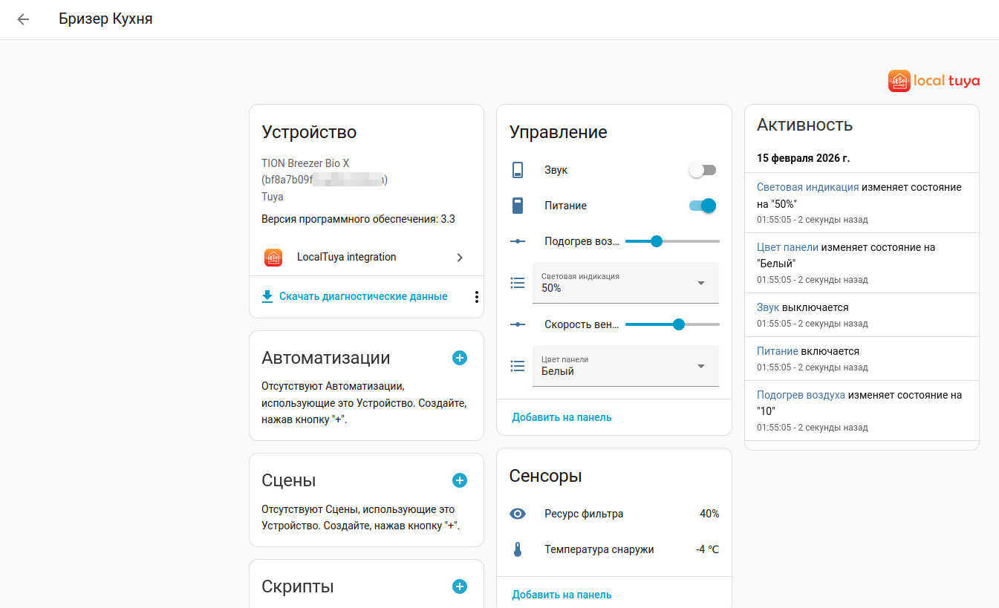

После настройки всё должно работать. Бризером TION Bio X наконец-то можно управлять из Home Assistant!

**Вы можете поблагодарить автора за эту инструкцию**

[](https://yoomoney.ru/to/410012435358371)
